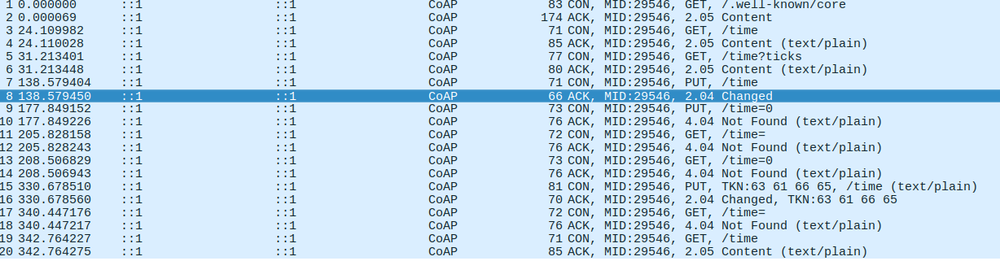

# RP2 P3 Constrained Application Protocol

## Alumnos

Sergio Semedi Barranco

Lucas Segarra Fernández

## Guión

__Ejecuta los programas servidor y cliente CoAP del directorio__
__examples.__
__Estudia sus opciones y parámetros de configuración. ¿En qué puertos y bajo qué protocolos__
__escucha el servidor CoAP tras su arranque?__

	$ netstat -ln

tcp6       0      0 [::]:5683               [::]:*                  LISTEN     
tcp6       0      0 [::]:5684               [::]:*                  LISTEN
udp6       0      0 [::]:5683               [::]:*                             
udp6       0      0 [::]:5684               [::]:*

**Investiga las opciones disponibles en el cliente y servidor con respecto a la cantidad
de mensajes de depuración a mostrar. Ejecuta el servidor CoAP con suficiente nivel
de detalle en los mensajes de depuración**

Para ello puedes ejecutar tanto el cliente o el servidor con la opción -v 10

./co-server -v 10
Dec 18 19:25:05 DEBG created UDP endpoint [::]:5683
Dec 18 19:25:05 DEBG created DTLS  endpoint [::]:5684
Dec 18 19:25:05 DEBG created TCP endpoint [::]:5683
Dec 18 19:25:05 DEBG created TLS endpoint [::]:5684
Dec 18 19:25:17 DEBG   [::1]:5683 <-> [::1]:46689 (if1) UDP: new incoming session
Dec 18 19:25:17 DEBG   [::1]:5683 <-> [::1]:46689 (if1) UDP: received 15 bytes
:1 t:CON c:PUT i:736a {} [ Uri-Path:time ] :: '1000\x0A'
Dec 18 19:25:17 DEBG call custom handler for resource 0x2f0df10e
Dec 18 19:25:17 DEBG   [::1]:5683 <-> [::1]:46689 (if1) UDP: sent 4 bytes
Dec 18 19:27:15 DEBG  [::1]:5683 <-> [::1]:46689 (if1) UDP: session closed

**¿Qué recursos están disponibles en el servidor? Estudia el código fuente del mismo
para observar la correlación entre los recursos descubiertos y los programados en el
código. Averigua el significado de los atributos rt, ct, if y title**

Para iniciar los recurso expuestos, el servidor expone recursos con este metodo:

init_resources(coap_context_t ctx)

Hay una macro definida con char * para devolverla en la / inicial del servidor

#define INDEX "This is a test server made with libcoap (see https://libcoap.net)\n" \
                "Copyright (C) 2010--2016 Olaf Bergmann <bergmann@tzi.org>\n\n"

Una forma de descubrir una ruta sería la siguiente:

    r = coap_resource_init((unsigned char \*)"ttime", 5, COAP_RESOURCE_FLAGS_NOTIFY_CON);

**Consulta la marca de tiempo proporcionada por el servidor en modo legible (por ejemplo, Dec 13 14:20:43), y también en forma de ticks de reloj, utilizando la consulta adecuada. ¿Qué valor de retorno (código) incluye la respuesta CoAP si el proceso
ha tenido éxito?**

    user-iot@VM-IOT:~/workspace/libcoap/examples$ coap-client -m get -T cafe coap://[::1]/time
    Dec 18 22:24:42
    user-iot@VM-IOT:~/workspace/libcoap/examples$ coap-client -m get -T cafe coap://[::1]/time?ticks
    1513635887

Tal y como se aprecia en la captura de pantalla, realizamos peticiones **GET** de los **URI** *well-known/core* y *time* (en *human-readeable* y en *ticks*).

La respuesta que recibimos del servidor es la siguiente:

***
Constrained Application Protocol, Acknowledgement, 2.05 Content, MID:29546
    01.. .... = Version: 1
    ..10 .... = Type: Acknowledgement (2)
    .... 0000 = Token Length: 0
    Code: 2.05 Content (69)
    Message ID: 29546
    Opt Name: #1: Content-Format: text/plain; charset=utf-8
    Opt Name: #2: Max-age: 1
    End of options marker: 255
    [Request In: 3]
    [Response Time: 0.000046000 seconds]
    Payload: Payload Content-Format: text/plain; charset=utf-8, Length: 15
        Payload Desc: text/plain; charset=utf-8
        Line-based text data: text/plain
            Dec 18 17:56:30

***
Constrained Application Protocol, Acknowledgement, 2.05 Content, MID:29546
    01.. .... = Version: 1
    ..10 .... = Type: Acknowledgement (2)
    .... 0000 = Token Length: 0
    Code: 2.05 Content (69)
    Message ID: 29546
    Opt Name: #1: Content-Format: text/plain; charset=utf-8
    Opt Name: #2: Max-age: 1
    End of options marker: 255
    [Request In: 5]
    [Response Time: 0.000047000 seconds]
    Payload: Payload Content-Format: text/plain; charset=utf-8, Length: 10
        Payload Desc: text/plain; charset=utf-8
        Line-based text data: text/plain
            1513619797

***

**Modifica la marca de tiempo que proporciona el servidor CoAP. ¿Qué valor de retorno (código) incluye la respuesta CoAP si el proceso ha tenido éxito?**

Hacemos una petición **PUT** para cambiar el **URI** del recurso *time*. La respuesta que recibimos  es la siguiente:

***

Constrained Application Protocol, Acknowledgement, 2.04 Changed, MID:29546
    01.. .... = Version: 1
    ..10 .... = Type: Acknowledgement (2)
    .... 0100 = Token Length: 4
    Code: 2.04 Changed (68)
    Message ID: 29546
    Token: 63616665
    [Request In: 15]
    [Response Time: 0.000050000 seconds]

***

**Elimina el recurso time del servidor y, a continuación, modifica la marca de tiempo
mediante una orden PUT . ¿Qué valores de retorno (código) se devuelven en ambos
casos?**

***

	servidor:
	Dec 19 21:47:16 DEBG *  [::1]:5683 <-> [::1]:37356 (if1) UDP: received 9 bytes
	v:1 t:CON c:DELETE i:736a {} [ Uri-Path:time ]
	Dec 19 21:47:16 DEBG call custom handler for resource 0x2f0df10e
	Dec 19 21:47:16 DEBG *  [::1]:5683 <-> [::1]:37356 (if1) UDP: sent 4 bytes

***

**Fuerza el uso de TCP en el cliente mediante la opción correspondiente y estudia las principales diferencias entre los mensajes intercambiados con respecto al uso de UDP.**

Comparamos a nivel de transporte y a nivel de aplicación dos peticiones de tipo *GET* y sus respectivas respuestas con TCP y UDP.

