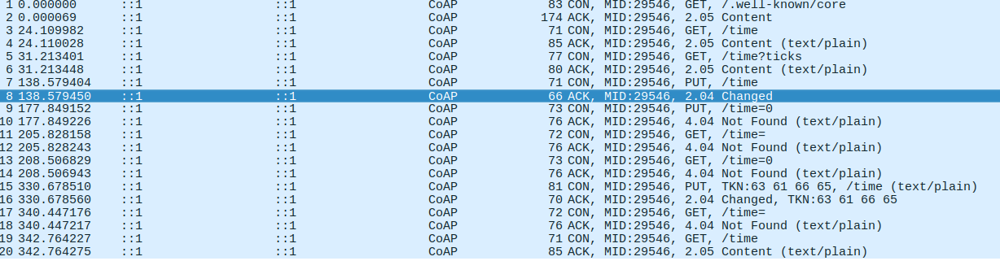

Tal y como se aprecia en la captura de pantalla, realizamos peticiones **GET** de los **URI** *well-known/core* y *time* (en *human-readeable* y en *ticks*).

También hacemos una petición **PUT** para cambiar el **URI** del recurso *time*. La respuesta que recibimos cuando dicha petición tiene éxito es la siguiente:

***
Constrained Application Protocol, Acknowledgement, 2.04 Changed, MID:29546  
    01.. .... = Version: 1  
    ..10 .... = Type: Acknowledgement (2) 
    .... 0000 = Token Length: 0  
    Code: 2.04 Changed (68) 
    Message ID: 29546 
    [Request In: 7]   
    [Response Time: 0.000046000 seconds]  
***

